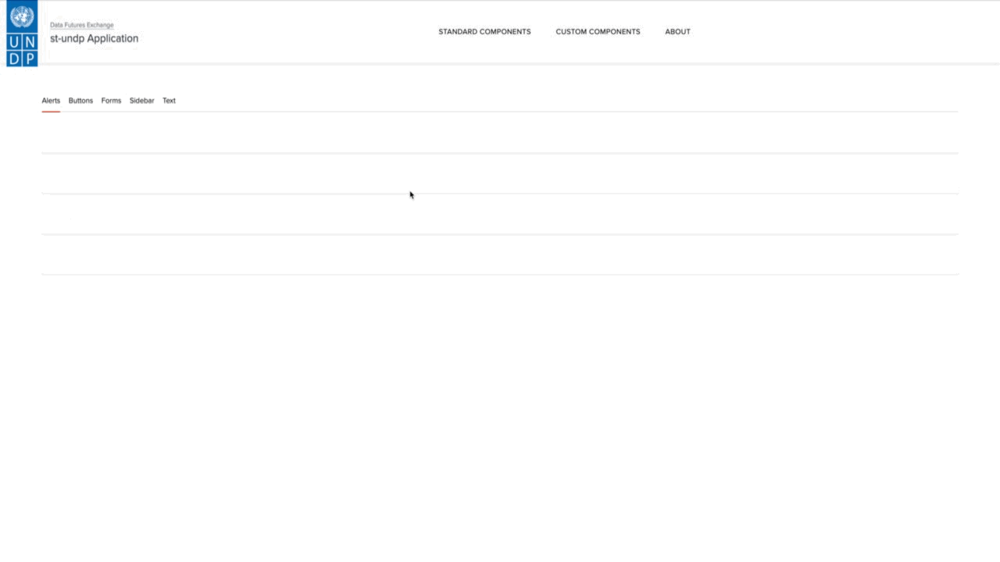

# st-undp

[](https://github.com/undp-data/st-undp/actions/workflows/azure-webapps-python.yml)
[](https://www.python.org/downloads/release/python-3110/)
[](https://github.com/undp-data/st-undp/blob/main/LICENSE)

A utility package that styles Streamlit apps according to [UNDP Design System](https://design.undp.org).
Check out this [live demo app]((https://st-undp.azurewebsites.net)).



## Table of Contents

- [Installation](#installation)
- [Usage](#usage)
- [Features](#features)
- [Contributing](#contributing)
- [License](#license)
- [Contact](#contact)

## Installation

Currently, the package is distributed via GitHub only. You can install it with `pip`:

```bash
 pip install git+https://github.com/undp-data/st-undp.git@v0.1.0
```

You can also add it to your `requirements.txt`:

```requirements
st-undp @ git+https://github.com/undp-data/st-undp.git@0.1.0
```

See [VCS Support](https://pip.pypa.io/en/stable/topics/vcs-support/#vcs-support) for more details.

## Usage

The package is intended to make styling a breeze. The most basic usage involves only two simple steps.

First, use the CLI to set up the recommended theme in `.streamlit/config.toml`:

```shell
python -m st_undp configure
```

This will edit the theme section in the file if it exists or create it if it doesn't.
Then, call `apply_style` function inside your application entry point, typically `app.py`: 

```python
import st_undp
import streamlit as st

st_undp.apply_style()

st.title("Hello world!")  # now UNDP-styled
```

## Features

This package is currently in the early stages of development. Main features include:

- `ProximaNova` fonts
- CSS styles for most Streamlit input components
- Several custom components from the UNDP Design System, such as Author, Footer, Header, Stats Card
- No additional dependencies on top of what is required by `streamlit`

## Contributing

All contributions must follow [Conventional Commits](https://www.conventionalcommits.org/en/v1.0.0/).
The codebase is formatted with `black` and `isort`. Use the provided [Makefile](./Makefile) for these
routine operations.

1. Clone or fork the repository
2. Create a new branch (`git checkout -b feature-branch`)
3. Make your changes
4. Ensure your code is properly formatted (`make format`)
5. Commit your changes (`git commit -m 'Add some feature'`)
6. Push to the branch (`git push origin feature-branch`)
7. Open a pull request

## License

This project is licensed under the BSD 3-Clause License. However, entities or individuals not affiliated with UNDP 
are strictly prohibited from using this package or any of its components to create, share, publish, or distribute works 
that resemble, claim affiliation with, or imply endorsement by UNDP.

UNDP’s name, emblem and its abbreviation are the exclusive property of UNDP and are protected under international law. 
Their unauthorized use is prohibited, and they may not be reproduced or used in any manner without UNDP’s prior written permission. 

## Contact

This project is part of [Data Futures Exchange (DFx)](https://data.undp.org) at UNDP.
If you are facing any issues or would like to make some suggestions, feel free to 
[open an issue](https://github.com/undp-data/st-undp/issues/new/choose). 
For enquiries about DFx, visit [Contact Us](https://data.undp.org/contact-us).
